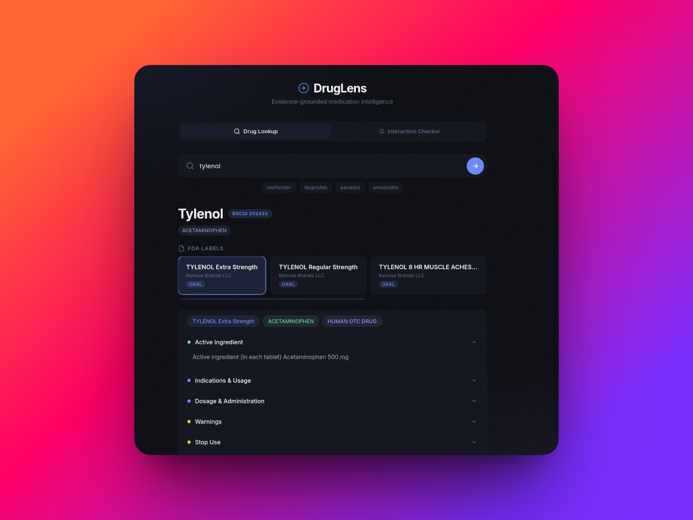
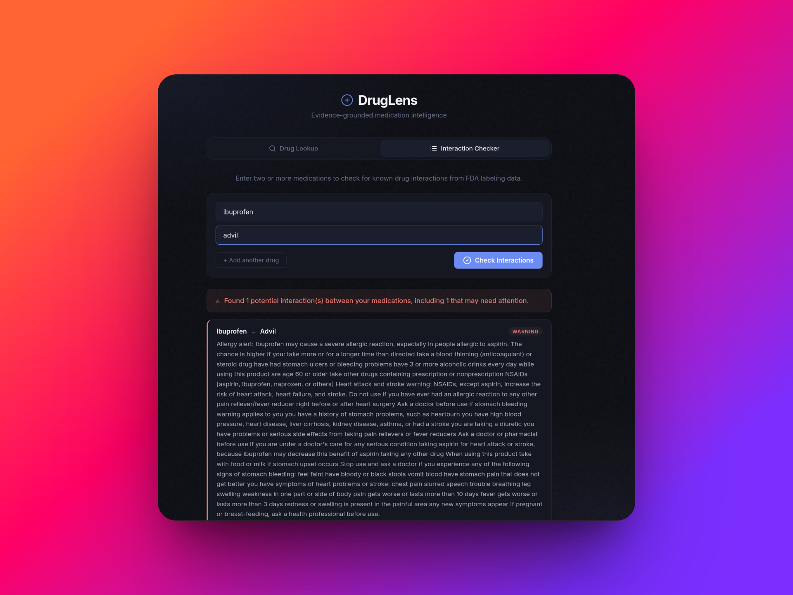

<p align="center">
  
  
  
  
</p>

<h1 align="center">💊 DrugLens</h1>
<p align="center">
  <strong>Evidence-grounded medication intelligence assistant</strong><br>
  <sub>Look up any drug. Check interactions. All backed by real FDA data.</sub>
</p>

<div align="center">
  
  
</div>

---

## What is DrugLens?

DrugLens is a lightweight, self-hosted medication assistant that bridges the gap between dense FDA pharmacological databases and everyday readability. Type in a medicine name and instantly get structured, cleaned information — indications, side effects, warnings, dosages, and more — pulled directly from official FDA drug labels.

It's built for **personal use**, **students**, and **healthcare professionals** who want fast, no-nonsense access to drug data without wading through walls of regulatory text.

### ✨ Key Features

| Feature | Description |
|---|---|
| **🔍 Drug Lookup** | Search by brand name, generic name, or active ingredient. Returns all matching FDA labels. |
| **⚡ Drug Interaction Checker** | Enter 2–6 medications and get instant cross-referencing against FDA interaction data. Flags are color-coded by severity. |
| **📋 Multi-Label Support** | Many drugs have multiple FDA labels from different manufacturers. Browse and compare them all. |
| **🧹 Smart Text Cleaning** | Strips section numbers, redundant headers, and regulatory boilerplate so you see only the useful content. |
| **🌊 Cascading Search** | Resolves drugs via RxNorm → RxCUI → FDA label. Falls back through generic name → brand name searches automatically. |

---

## Architecture

```
┌──────────────────────────────────────────────────┐
│                   Frontend                       │
│          Vanilla HTML / CSS / JS                 │
│    ┌──────────────┐  ┌────────────────────┐      │
│    │  Drug Lookup  │  │ Interaction Checker │      │
│    └──────┬───────┘  └────────┬───────────┘      │
└───────────┼───────────────────┼───────────────────┘
            │                   │
            ▼                   ▼
┌──────────────────────────────────────────────────┐
│               FastAPI Backend                    │
│                                                  │
│  GET /api/drugs/{name}      → DrugSearchResult   │
│  GET /api/interactions?drugs=a,b  → InteractionCheck │
│  GET /health                → { status: ok }     │
│                                                  │
│  ┌────────────────────────────────────────────┐  │
│  │           Ingestion Layer                  │  │
│  │  drug_client.py                            │  │
│  │  • get_rxcui()       → NIH RxNorm API     │  │
│  │  • get_fda_labels()  → OpenFDA API         │  │
│  │  • get_drug_interactions()                 │  │
│  └────────────────────────────────────────────┘  │
└──────────────────────────────────────────────────┘
            │                   │
            ▼                   ▼
    ┌───────────────┐   ┌───────────────┐
    │  NIH RxNorm   │   │  OpenFDA API  │
    │  (Drug IDs)   │   │  (Labels)     │
    └───────────────┘   └───────────────┘
```

---

## Quick Start

### Prerequisites

- Python 3.12+
- `pip` packages: `fastapi`, `uvicorn`, `requests`, `pydantic`

### 1. Clone & Install

```bash
git clone https://github.com/yourusername/DrugLens.git
cd DrugLens
pip install fastapi uvicorn requests pydantic
```

### 2. Run

```bash
python -m uvicorn backend.app.main:app --reload
```

### 3. Open

Navigate to **http://localhost:8000** in your browser.

---

## Project Structure

```
DrugLens/
├── backend/
│   └── app/
│       ├── __init__.py
│       └── main.py             # FastAPI app, endpoints, Pydantic models
├── frontend/
│   ├── index.html              # UI structure (tabs, search, results)
│   ├── style.css               # Dark theme, glassmorphism, animations
│   └── app.js                  # Client logic, tab switching, rendering
├── ingestion/
│   ├── drug_client.py          # RxNorm + OpenFDA API client functions
│   └── fetch_drug.py           # Standalone fetch utilities
├── data/                       # Local data cache (if needed)
├── tests/                      # Test suite
└── README.md
```

---

## API Reference

### `GET /api/drugs/{drug_name}`

Look up a medication by name. Returns up to 5 matching FDA labels with parsed fields.

**Response:**
```json
{
  "name": "metformin",
  "rxcui": "6809",
  "label_count": 5,
  "labels": [
    {
      "brand_names": ["ZITUVIMET"],
      "generic_names": ["SITAGLIPTIN AND METFORMIN HYDROCHLORIDE"],
      "manufacturer": ["Zydus Lifesciences Limited"],
      "substance_name": ["SITAGLIPTIN", "METFORMIN HYDROCHLORIDE"],
      "route": ["ORAL"],
      "product_type": "HUMAN PRESCRIPTION DRUG",
      "indications_and_usage": "...",
      "adverse_reactions": "...",
      "warnings": "...",
      "contraindications": "...",
      "dosage_and_administration": "..."
    }
  ]
}
```

### `GET /api/interactions?drugs=drug1,drug2`

Check for known interactions between 2–6 drugs. Cross-references each drug's FDA interaction text against the others' names and active substances.

**Response:**
```json
{
  "drugs": [
    { "drug_name": "metformin", "rxcui": "6809", "found": true, "interaction_text": "..." },
    { "drug_name": "insulin", "rxcui": "5856", "found": true, "interaction_text": "..." }
  ],
  "flags": [
    {
      "drug_a": "metformin",
      "drug_b": "insulin",
      "severity": "warning",
      "detail": "Coadministration may increase the risk of hypoglycemia..."
    }
  ],
  "summary": "Found 1 potential interaction(s), including 1 that may need attention."
}
```

---

## Data Sources

| Source | Used For | URL |
|---|---|---|
| **NIH RxNorm** | Resolving drug names → standardized RxCUI identifiers | [rxnav.nlm.nih.gov](https://rxnav.nlm.nih.gov/) |
| **OpenFDA Drug Labels** | Full structured drug label data (indications, warnings, interactions, etc.) | [api.fda.gov](https://api.fda.gov/) |

Both APIs are **free**, **public**, and require **no API key**.

---

## Roadmap

- [x] Drug lookup with multi-label support
- [x] Drug interaction checker
- [x] Smart text cleaning (strip section numbers & headers)
- [x] Cascading search fallback (RxCUI → generic → brand)
- [ ] LLM-powered plain-English summaries (Qwen2.5-0.5B)
- [ ] Adverse event reports with charts (OpenFDA `/drug/event.json`)
- [ ] Drug recall alerts (OpenFDA `/drug/enforcement.json`)
- [ ] Personal medicine cabinet with interaction monitoring
- [ ] Drug comparison mode (side-by-side)
- [ ] Pill identifier

---

## Disclaimer

> **DrugLens is for informational purposes only.** It is not a substitute for professional medical advice, diagnosis, or treatment. Always consult a qualified healthcare provider before making medication decisions. The data comes directly from FDA-approved labeling and may not reflect the most recent updates.

---

## License

MIT — do whatever you want with it.
